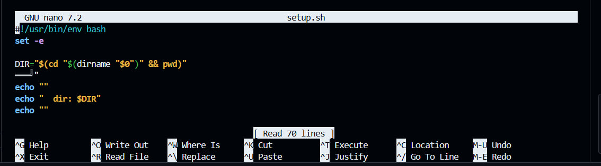

### Octra Devnet CLI ( PC + Mobile ) 

### Offical Link by Octra - https://github.com/octra-labs/octra_ref_client

----

## 🧰 Prerequisites ( optional - direct use official link )
	
1. Go to Github https://github.com/new
2. Make New Repository name (e.g. `octra`)
3. Click the green `Code` button
4. Select → `Open with Codespaces` → `+ New codespace`
5. Wait for the environment to fully load

----
## Dependencies for Github 
```
cd /workspaces
rm -rf octra_ref_client
git clone --depth=1 https://github.com/octra-labs/octra_ref_client.git
cd octra_ref_client
```
### Run ( Run Kro )
```
bash setup.sh
```
## Importent - IF Some Error Occurs Then Edit ( Agar Tumhe Kuch Error Ata h To Edit KArni Hogi )  
```
nano setup.sh
```
You Have To Remove Thise From It ( ═══╝" )



You Should Be Like Thise ( Aapko Aisa Dikhna Chaiye ) 
```
#!/usr/bin/env bash
set -e

DIR="$(cd "$(dirname "$0")" && pwd)"

echo ""
echo "  dir: $DIR"
echo ""
```
## Direct Run ( Agar Apke Pass Pahle Se Wallet HAi To Ye CMD Run Karne SE phle Wallet Import kAr Lena )

Import Wallet - create New file `wallet.json`
```
{
  "priv": "Paste Your private Key=",
  "addr": "PAste Your Adress",
  "rpc": "https://devnet.octra.com"
}
```
All Set
### Run ( All Set ) 
```
./venv/bin/python3 cli.py
```
### Claim Foucet- https://faucet-devnet.octra.com/
### Exploer - https://scan.octra.com/

### More Update Follow Now - 


